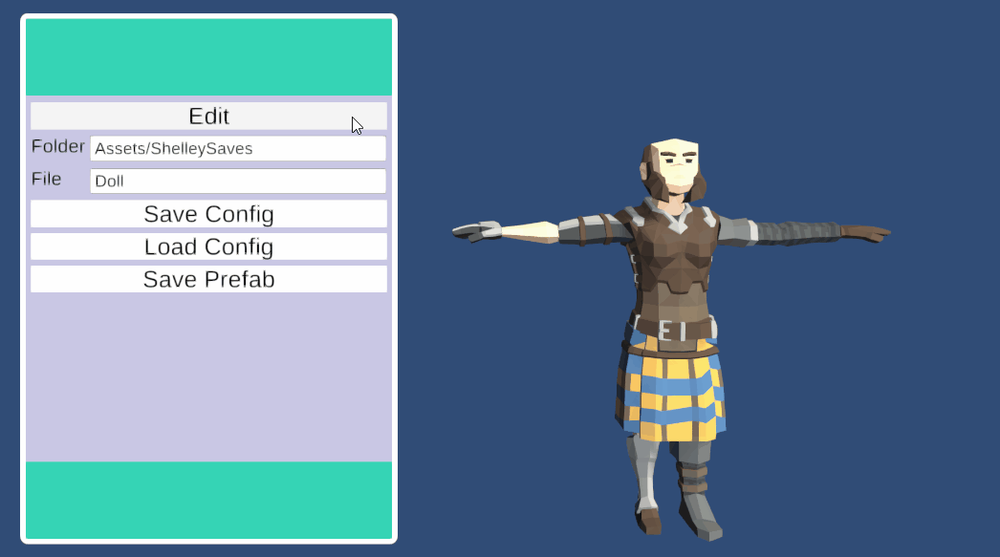

# Shelley

A character creator for Synty Studio's `POLYGON - Modular Fantasy Hero Characters`. Save prefabs of the characters you make.
A config" option is also available, but requires scripting to load.

Tested on Unity 2019.3.10f1 Personal

## First-Time Setup
1. Clone the repo and open it in Unity
1. Install the required assets:
    * [POLYGON - Modular Fantasy Hero Characters](https://assetstore.unity.com/packages/3d/characters/humanoids/polygon-modular-fantasy-hero-characters-143468) (tested with version 1.22)
    * [Proedural UI Image](https://assetstore.unity.com/packages/tools/gui/procedural-ui-image-52200) (tested with version 2.2) (or try the [no-procedural-image branch](https://github.com/cmaher/Shelley/tree/no-procedural-image))
    * TextMesh Pro (via the package manager)
1. Upgrade the Synty shaders, following `PolygonFantasyHeroCharacters/RenderPipeline_ReadMe`
1. Remove the `PolygonFantasyHeroCharacters/Scripts` directory
1. Update the references in Shelley/Scripts/ShelleyStudio/ShelleyStudioAssembly.asmdef
    * ./Assets/ProceduralUIImage/ProceduralUIImageAssembly.asmdef (create this first)
    * Unity.TextMeshPro (should be available after installing TextMeshPro)
1. Move `Assets/polygonFantasyHeroCharacters/Prefabs/Characters_ModularParts_Static` to `Assets/Resources/PolygonFantasyHeroCharacters/Prefabs/Characters_ModularParts_Static`

Finally, load Shelley/Scenes/Designer, and enter play mode. Note that the UI is built around a 1080p resolution.

## TODO
* Remove ProceduralUIImage so that the only paid asset requires will be Modular Fantasy Hero Characters
* Less terrible UI
* Rotate the character & parts
* Change the camera position
* Maybe obey head attachment & head element rules
* Smoother/automated first time setup

## License

Unless otherwise noted, all code is subject to the MIT license, as specified in the [LICENSE](LICENSE).

Code in the `UnityUIExtensions` directory is comes from the [UnitiyUIExtensions project](https://bitbucket.org/UnityUIExtensions/unity-ui-extensions) and is minimally modified by me at most.
